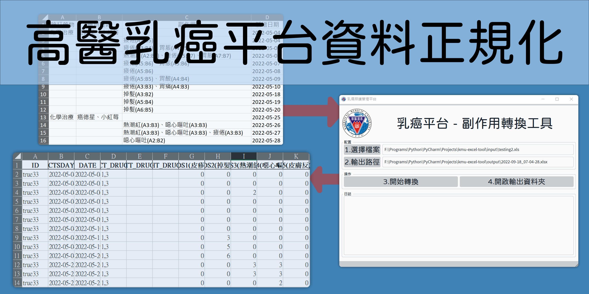

# KMU SCBC Tool



該專案為高醫乳癌平台的專用軟體，將平台所匯出的個案副作用資料進行正規化，提供後續分析使用。

該軟體為一個圖形化介面程式，使用基於 QT 的 PiSide6 產生圖形介面，並使用 cx-freeze 凍結 Python 運行環境，可打包成安裝型應用程式或可攜型應用程式。並且在 Windows、MacOS、Linux 皆可執行。

## Environment

- python 3.9 or later

```bash
pip install -r requirements.txt
```

2022.09.18: 該專案在 Windows、MacOS、Ubuntu 作業系統上使用 Python3.9 編譯測試通過，應用程式執行測試通過。

## Run

```bash
python app.py
```

啟動圖形應用程式，軟體操作步驟：

1. 點擊按鈕選擇輸入檔案（.xlsx）。
2. 點擊按鈕選擇轉換檔案的輸出路徑。
3. 點擊「開始轉換」按鈕。
4. 開啟輸出資料夾查看轉換結果（.xlsx）。

## Build

```bash
python setup.py build
```

打包成可執行檔案，構建結果輸出在 `./build` 目錄下，根據不同作業系統打包在相應的目錄名稱中，執行目錄中的 `./app.exe` 啟動圖形應用程式。

> 注意：Windows 11 必須使用 Python 3.9 以上版本構建。

## Structure

- `app.py`: 匯入 `app.ui` 樣式表並傾聽介面元件，呼叫 `helper.py` 執行程式邏輯。
- `app.ui`: 使用 QT Designer 產生的 GUI 樣式表，並使用 `app.py` 匯入，若使用 cx-freeze 打包則必須放在根目錄使用。
- `codebook.py`: 內容正規化轉換對照表。
- `helper.py`: 打包成一個輔助類別，提供 `app.py` 呼叫。
- `setup.py`: 提供 `cx-freeze` 打包的腳本，配置構建應用程式的相關設定、路徑等。